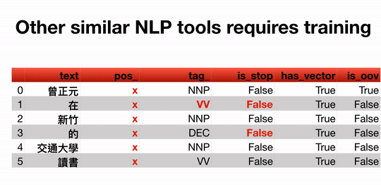
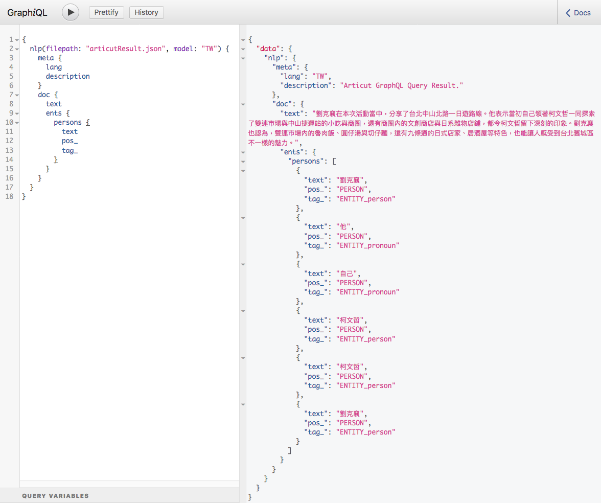

Switch to: [中文版 ReadMe](./ReadMe_TW.md)
------------------------------

# Articut-GraphQL (Psudo-spaCy NLP Tool for Chinese)

Articut-GraphQL the most practical sPacy NLP tool for Chinese language. It is not driven by Machine Learning but Chinese Language Syntactic Rules. Simply load the .json file which contains the text processed with Articut CWS, then you are good to go.

## Use it Online

To be released soon...(very soon, I promise.)

### Features
Taking the sentence **`曾正元在新竹的交通大學讀書`** (Zeng, Jen-yuan studies in the Chiao Tung University in Hsinchu.) for example, the difference of `doc` between using spaCy and Articut-GraphQL are shown below:



### NER

Articut-GraphQL can recognize [Person]、[Pronoun]、[Location]、[Route names in Taiwan]、 [Address in Taiwan]、[URL]...etc named entities.


## Using Articut-GraphQL
### System requirement

Python 3.6.1+

### Download
`git clone git@github.com:Droidtown/ArticutAPI.git`

### Specify a text file
Taking file **"articutResult.json"** for example, the content of the file is the processed results of some Chinese text by Articut and saved as .json format.

**`filepath: "articutResult.json"`**

### Specify Syntactic Rules:
Currently, we only support "Traditional Chinese", so it has to be "TW" now.

**`model:"TW"`**

### doc Manual
```
text				=> Content of the text
tokens {			=> Attributes of the tokens
  text				=> Text of the token
  pos_				=> SpaCy POS Tag
  tag_				=> Articut POS Tag
  isStop
  isEntity
  isVerb
  isTime
  isClause
  isKnowledge
}
ents {
  persons {			=> Persons and Pronouns
    text
    pos_
    tag_
  }
  nouns {			=> Nouns and Named Entities
    text
    pos_
    tag_
  }
  numbers {			=> Numbers and Quantity Expressions
    text
    pos_
    tag_
  }
  sites {			=> Location, Road names of Taiwan and Address of Taiwan
    text
    pos_
    tag_
  }
}
```

### Begin Using GraphQL

### Using GraphiQL 

GraphiQL requuires modules listed below. You may install them easily with pip:

```
$ pip install graphene
$ pip install starlette
$ pip install jinja2
$ pip install uvicorn
```

Execute ArticutGraphQL.py with the filepath lead to the result of your text document processed with Articut. Then, open your Internet browser and use URL: `http://0.0.0.0:8000/`

```
$ python ArticutGraphQL.py articutResult.json
```

### Example 01


### Example 02


### Using Articut-GraphQL
`graphene` module is required, you may simply install graphene module with pip:

```
$ pip install graphene
```
### Example 01
```
inputSTR = "地址：宜蘭縣宜蘭市縣政北七路六段55巷1號2樓"
result = articut.parse(inputSTR)
with open("articutResult.json", "w", encoding="utf-8") as resultFile:
    json.dump(result, resultFile, ensure_ascii=False)
	
graphQLResult = articut.graphQL.query(
    filePath="articutResult.json",
    query="""
	{
	  meta {
	    lang
	    description
	  }
	  doc {
	    text
	    tokens {
	      text
	      pos_
	      tag_
	      isStop
	      isEntity
	      isVerb
	      isTime
	      isClause
	      isKnowledge
	    }
	  }
	}""")
pprint(graphQLResult)
```

### Result:


### Example 02
```
inputSTR = inputSTR = "劉克襄在本次活動當中，分享了台北中山北路一日遊路線。他表示當初自己領著柯文哲一同探索了雙連市場與中山捷運站的小吃與商圈，還有商圈內的文創商店與日系雜物店鋪，都令柯文哲留下深刻的印象。劉克襄也認為，雙連市場內的魯肉飯、圓仔湯與切仔麵，還有九條通的日式店家、居酒屋等特色，也能讓人感受到台北舊城區不一樣的魅力。"
result = articut.parse(inputSTR)
with open("articutResult.json", "w", encoding="utf-8") as resultFile:
    json.dump(result, resultFile, ensure_ascii=False)
	
graphQLResult = articut.graphQL.query(
    filePath="articutResult.json",
    query="""
	{
	  meta {
	    lang
	    description
	  }
	  doc {
	    text
	    ents {
	      persons {
	        text
	        pos_
	        tag_
	      }
	    }
	  }
	}""")
pprint(graphQLResult)
```

### Result:


## License

MIT License - Details: [LICENSE.md](https://github.com/Droidtown/ArticutAPI/blob/master/LICENSE)